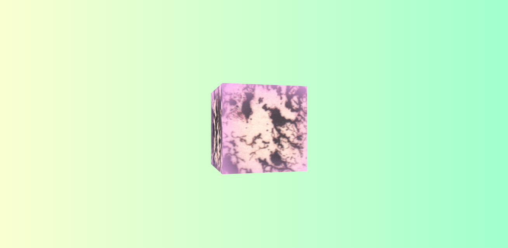

## Introduction

Having a little play with CSS animations to see what can/can't be done. Ended up with a chilled-out psychedelic cube slowly spinning in space.



## Instructions

Clone this repo:

```
$ git clone git@github.com:sitypop/CSS_cube.git
```

Open it:

```
$ cd CSS_cube
$ open index.html
 ```

Have a play with colours/speed/size/direction! 🍭
